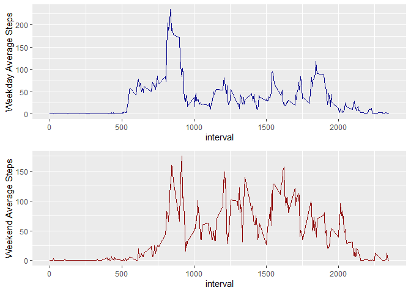

R Markdown
----------

### load data

    library(tidyverse)

    ## -- Attaching packages -------------------------------------------------------------------------- tidyverse 1.2.1 --

    ## v ggplot2 3.2.1     v purrr   0.3.2
    ## v tibble  2.1.3     v dplyr   0.8.3
    ## v tidyr   1.0.0     v stringr 1.4.0
    ## v readr   1.3.1     v forcats 0.4.0

    ## -- Conflicts ----------------------------------------------------------------------------- tidyverse_conflicts() --
    ## x dplyr::filter() masks stats::filter()
    ## x dplyr::lag()    masks stats::lag()

    library(dplyr)

    PAdata <- read.csv("activity.csv", stringsAsFactors = FALSE)
    PAdata$date <- as.Date(PAdata$date, "%Y-%m-%d")
    summary(PAdata)

    ##      steps             date               interval     
    ##  Min.   :  0.00   Min.   :2012-10-01   Min.   :   0.0  
    ##  1st Qu.:  0.00   1st Qu.:2012-10-16   1st Qu.: 588.8  
    ##  Median :  0.00   Median :2012-10-31   Median :1177.5  
    ##  Mean   : 37.38   Mean   :2012-10-31   Mean   :1177.5  
    ##  3rd Qu.: 12.00   3rd Qu.:2012-11-15   3rd Qu.:1766.2  
    ##  Max.   :806.00   Max.   :2012-11-30   Max.   :2355.0  
    ##  NA's   :2304

### group by date & summarize

    PAdata_bg <- group_by(PAdata, date)
    PAdata_summary <- summarize(PAdata_bg, totalSteps=sum(steps, na.rm=TRUE))

### plot histogram

    p <- ggplot(PAdata_summary, aes(x=date, y=totalSteps))+
        geom_bar(stat="identity", color="dark blue", fill="light blue")
    print(p)

### Summarize data grouped by date to get mean and median

    s1 <- summarize(PAdata_bg, mean(steps, na.rm=TRUE), median(steps, na.rm=TRUE))
    names(s1) <- c("date", "means", "medians")
    print(s1)

    ## # A tibble: 61 x 3
    ##    date         means medians
    ##    <date>       <dbl>   <dbl>
    ##  1 2012-10-01 NaN          NA
    ##  2 2012-10-02   0.438       0
    ##  3 2012-10-03  39.4         0
    ##  4 2012-10-04  42.1         0
    ##  5 2012-10-05  46.2         0
    ##  6 2012-10-06  53.5         0
    ##  7 2012-10-07  38.2         0
    ##  8 2012-10-08 NaN          NA
    ##  9 2012-10-09  44.5         0
    ## 10 2012-10-10  34.4         0
    ## # ... with 51 more rows

### Plot time series of averages

    p2 <- ggplot(s1, aes(x=date, y=means, na.rm=TRUE )) + geom_bar(stat="identity", color="dark blue", fill="steelblue4")
    print(p2)

    ## Warning: Removed 8 rows containing missing values (position_stack).

### the 5-minute interval with the maximum number of steps

    s2 <- aggregate(steps ~ date, PAdata_bg, max)
    s2 <- merge(s2, PAdata_bg)
    print(mean(s2$interval))

    ## [1] 1186.091

### impute for NA values

    totalNA <- sum(complete.cases(PAdata))
    print(totalNA)

    ## [1] 15264

    averageSteps <- aggregate(steps ~ interval, PAdata, FUN=mean)
    newSet <- numeric()
    for (i in 1:nrow(PAdata)) {
      if(is.na(PAdata[i,]$steps)) {
        steps <- subset(averageSteps, interval == PAdata[i,]$interval)$steps
      }
      else
      {
        steps <- PAdata[i,]$steps
      }
      newSet <- c(newSet, steps)
    }

    PAdata_new <- PAdata
    PAdata_new$steps <- newSet

    # Histogram of total steps each day after imputing missing data
    PAdata_new_summ <- PAdata_new %>% group_by(date) %>% summarize(sum=sum(steps))
    PAdata_newplot <- ggplot(PAdata_new_summ, aes(x=date, y=sum)) + 
      geom_bar(stat="identity",color="dark blue", fill="steelblue") + 
      ylab("totalSteps by day - no NAs")
    print(PAdata_newplot)

### Panel Graph for weekday and weekend average steps by Interval

    library(gridExtra)

    ## 
    ## Attaching package: 'gridExtra'

    ## The following object is masked from 'package:dplyr':
    ## 
    ##     combine

    PAdata_int <- PAdata %>% mutate(Weekday=ifelse(weekdays(date)=="Saturday" |
                                                     weekdays(date)=="Sunday",0,1))
    PAdata_summ <- PAdata_int %>% 
      group_by(interval, Weekday) %>% 
      summarize(AverageSteps=mean(steps, na.rm=TRUE))
    wkdayPlot <- ggplot(filter(PAdata_summ,Weekday==1),aes(x=interval, y=AverageSteps))+
                          geom_line(col="dark blue")+ylab("Weekday Average Steps")
    wkendPlot <- ggplot(filter(PAdata_summ,Weekday==0),aes(x=interval, y=AverageSteps))+
                          geom_line(col="dark red")+ylab("Weekend Average Steps")
    grid.arrange(wkdayPlot, wkendPlot, nrow=2)

